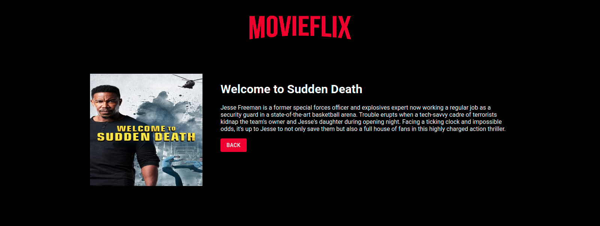

# React Gallery 

A front-end web app displaying movies using Heroku API. 

## Screenshots

<p align="center">
  
</p>
<p align="center">
  
</p>

## Getting started

1. Clone this repo and enter!

   ```bash
   git clone https://github.com/kasia-js/react-gallery.git
   ```

2. Install dependencies.

   ```bash
   npm i
   ```

3. Start the app.

  ```bash
   npm start
  ```

## Built with

- [React](https://reactjs.org/)
- [JavaScript](https://www.javascript.com/)
- [MaterialUI](https://material-ui.com/)
- [HTML](https://html.com/)
- [CSS](http://css.com/)
- And MORE! check package.json ;)

## Developers:

- Katarzyna Kolny - [GitHub](https://github.com/kasia-js) - [LinkedIn](https://www.linkedin.com/in/katarzyna-kolny-8b3384b9/)
- Rashmi Menon Vellekkat - [GitHub](https://github.com/RashmiBalaji) - [LinkedIn](https://www.linkedin.com/in/rashmi-menon-vellekkat-96bb88118/)

